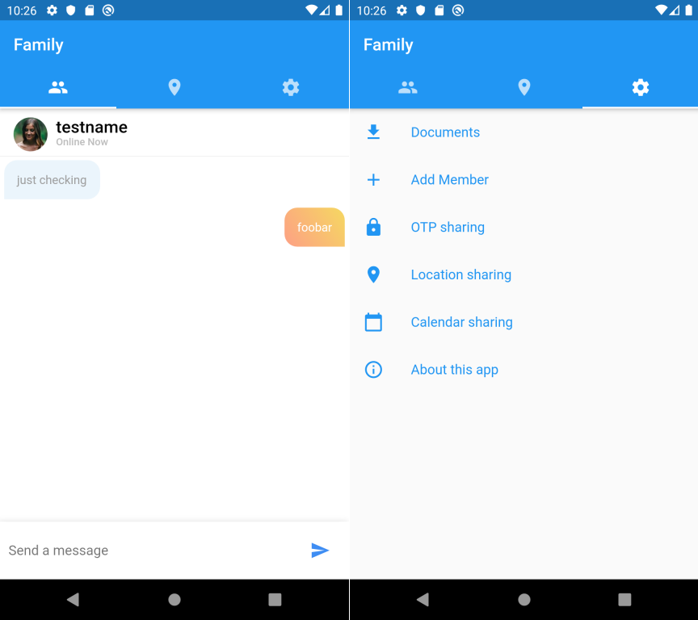
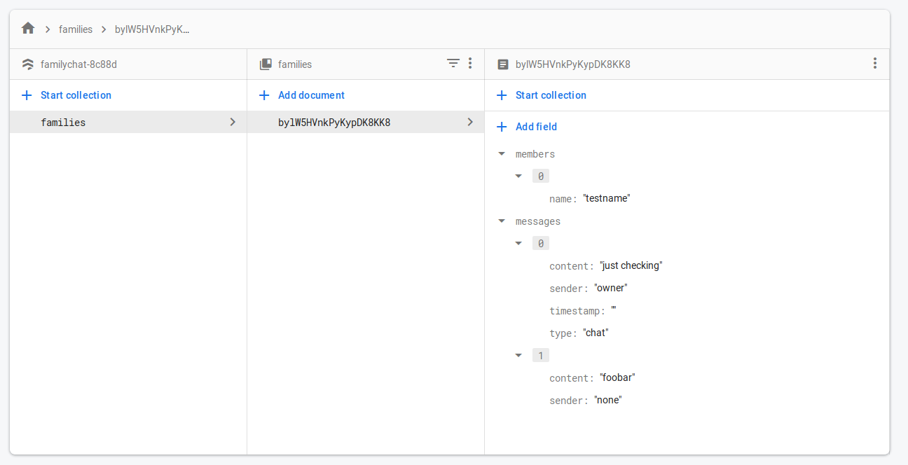

# Family

### Family members are not merely "contacts".

Messaging app for closed, trusted groups like families. NOT a social network. Open-source, ad-free, private and secure with end-to-end encryption, multi-platform and multi-device. Built with Flutter.

# Design principles

- This app will be a private and intimate space. No casual friends or followers. No strangers or advertisers.
- Purpose-built for maintaining a tight-knit bond with your family.
- Not relying on centralized identifiers like phone numbers.
- Everything, including messages, audio and video calls, and media (such as photos and documents) will be encrypted end-to-end.

# Feature Ideas

- Automatic sharing of home delivery/pickup alerts, and SMS which are sent to individuals but are actually relevant for the whole family (cab-booking  OTPs, train/flight PNRs/schedule/tracking etc)
- Lightweight shared knowledge-base: Important places, contacts, events, reminders and critical documents for wealth or health
- Low-friction location-sharing
- Photos and Video repository
- Secure vault for important documents (such as life insurance policy)
- Scan QR codes to add members
- Use Signal or Whatsapp's Double Ratchet protocol for end-to-end encryption
- Choose your own storage option:
  - Cloud Firestore with encrypted data and ability to delete
  - Federated server like a Matrix.org instance
  - Completely peer-to-peer (distributed, serverless) protocol like secure ScuttleButt

# How to Contribute

- Create a Firebase project and add your `google-services.json` file to `android/app` folder. Don't worry, this won't get committed as it is added in top-level `.gitignore`.

- Create a Cloud Firestore database with this structure:

- Replace the value of `familyId` in `lib/family.dart` and then launch the app. 