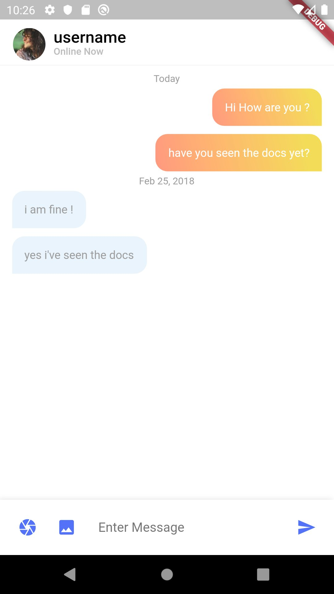

# Family

Messaging app for closed, trusted groups like families. NOT a social network. Open-source, ad-free, private and secure with end-to-end encryption, multi-platform and multi-device. Built with Flutter.

# Design principles

- This app will be a private and intimate space. No casual friends or followers. No strangers or advertisers.
- Purpose-built for maintaining a tight-knit bond with your family.
- Not relying on centralized identifiers like phone numbers.
- All messaging, including audio and video calls, and media (such as photos and documents) will be encrypted end-to-end.

# Feature Ideas

- Lightweight shared knowledge-base: Important places, contacts, events, reminders and critical documents for wealth or health
- Low-friction location-sharing
- Photos and Video repository
- Automated alerts like flight tracking
- Planning for shared life goals (for everyone, not just kids): Health, wealth and relationships
- Scan QR codes to add members
- Use Signal or Whatsapp's Double Ratchet protocol for end-to-end encryption
